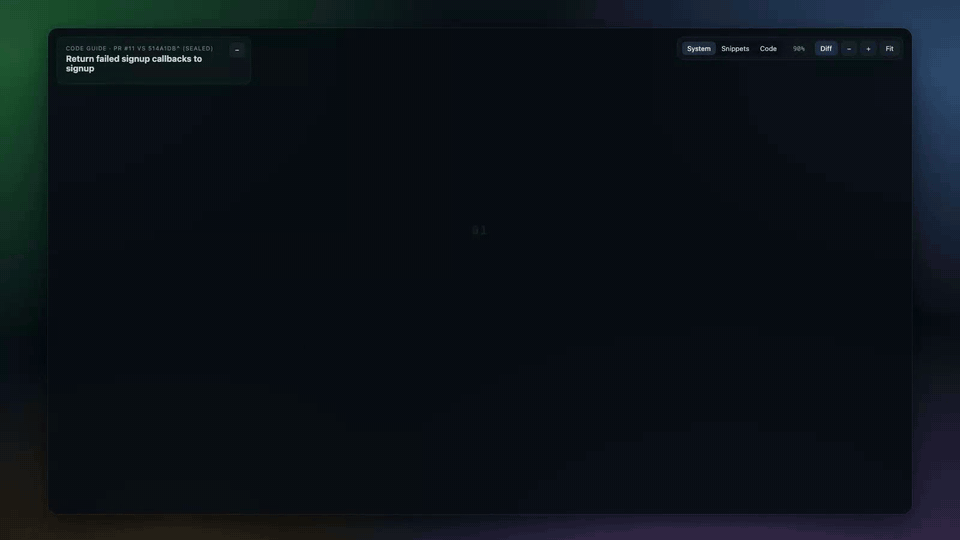
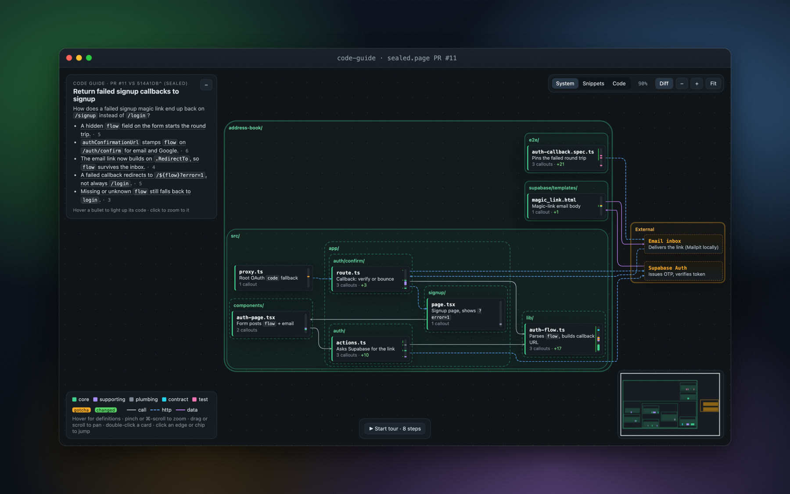
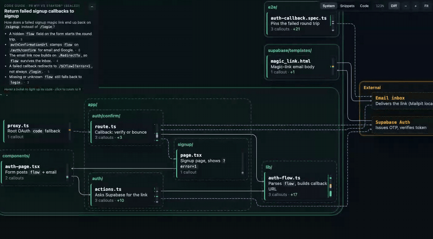
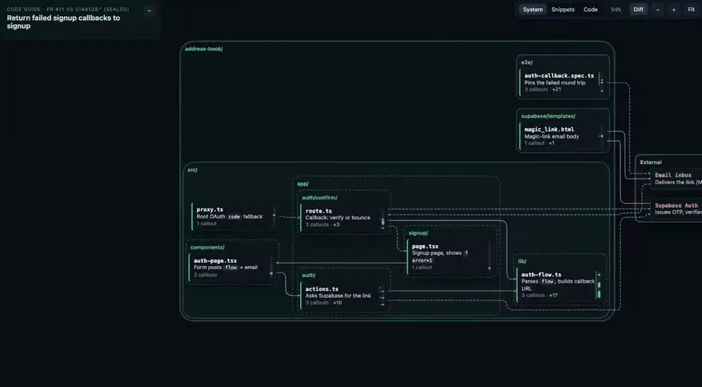
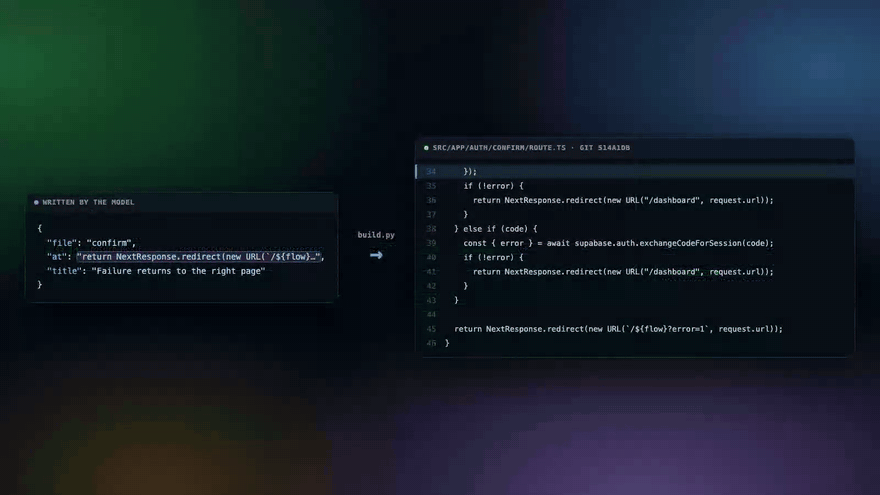
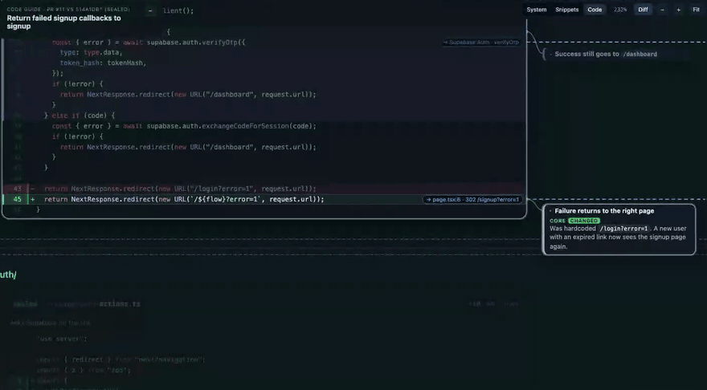
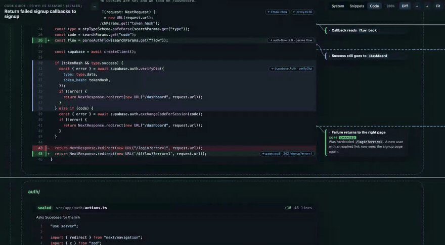
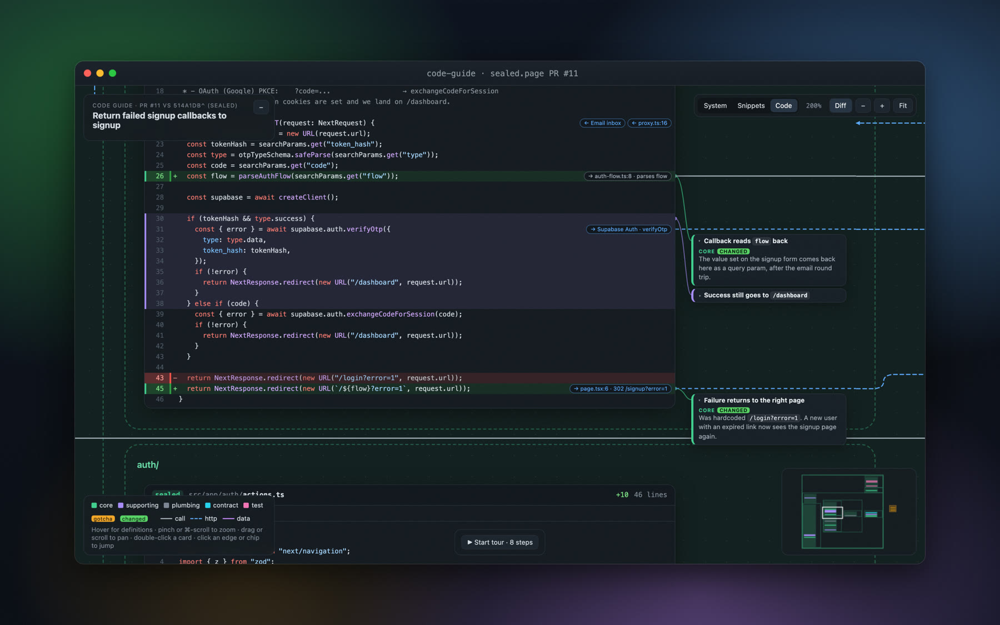

<p align="center">
  
</p>

<h1 align="center"><code>code-guide</code></h1>

<p align="center">
  <b>An agent skill that turns a pull request into a map you can zoom into.</b><br>
  It shows every file the PR touches, how they connect, and the lines that matter, with the code checked against git.
</p>

<p align="center">
  <a href="docs/media/code-guide-launch.mp4"><b>▶ Watch the 44s video</b></a> &nbsp;·&nbsp;
  <a href="docs/media/sealed-motion.mp4">Captioned walkthrough</a> &nbsp;·&nbsp;
  <a href="https://seanoliver.github.io/code-guide/"><b>Try the live demo</b></a> &nbsp;·&nbsp;
  <a href="#install"><b>Install</b></a>
</p>

<p align="center">
  
  
  
</p>

---

Ask your agent for a guide to a PR, and you get one HTML file:

```
"Make a code guide for PR #11"
```

<p align="center">
  
</p>

The demo above is PR #11 of [sealed.page](https://github.com/seanoliver/address-book), which sends a failed signup magic link back to `/signup` instead of `/login`. [Open it live](https://seanoliver.github.io/code-guide/) and zoom around.

## System view

**See the whole PR at once.** Each folder is a box and each file is a tile. Arrows show calls, data, and HTTP requests between them, and each tile's side bar maps where the highlighted lines sit in the file, top to bottom.

## Summary bullets

**Every claim points at its code.** Each TL;DR bullet carries references to the lines that prove it. Hover a bullet and those lines are highlighted in every file; click it to zoom there.

<p align="center"></p>

## Semantic zoom

**Zoom from folders to lines.** One continuous zoom runs through three levels: System (tiles), Snippets (just the highlighted lines), and Code (complete, syntax-highlighted files with callouts).

<p align="center"></p>

## Deterministic build

**Every line is deterministically checked against git.** The model never draws the canvas or picks line numbers. It writes a `guide.json` that quotes a piece of each line it wants to point at. Then `build.py` reads the files from git, finds each quote with a plain string match, computes the diff, and lays out the graph.

```
model ──writes──▶ guide.json ──build.py──▶ resolves every quote against the file from git
                                           git diff base...HEAD → added and deleted lines
                                           ELK auto-layout → one self-contained HTML file
```

A quote that matches nothing, or matches more than one line, fails the build. A callout can't point at the wrong line.

<p align="center"></p>

## Merged diff

**Diffs merged in place.** In PR mode, deleted lines sit in red directly above the lines that replaced them, numbered by their old line numbers. Press `d` and they fold away so you can read the final file.

<p align="center"></p>

## Callouts

**Callouts open beside the line.** In Code view each callout is a one-line title next to the line it explains. Click to open it. It stays open until you close it.

<p align="center"></p>

## Guided tour

Every guide includes a 4–9 step tour in reading order. Each step zooms to one line and highlights the links it crosses. Arrow keys step through it.

<p align="center">
  
</p>

## Install

**Claude Code**

```
/plugin marketplace add seanoliver/code-guide
/plugin install code-guide@code-guide
```

**Other agents**: copy `skills/code-guide/` into any agent's skills folder that loads `SKILL.md` skills.

**Requirements:** `python3`, `git`, and a browser. `gh` is used to read PR descriptions.

## Usage

```
"Make a code guide for PR #482"
"Walk me through this branch visually"
"Show me how the checkout flow works as a code guide"
```

- `pr` mode: the PR's changed files plus the code they call or are called by, with the merged diff.
- `explore` mode: traces one question ("how does X work") from its entry point to where the behavior is decided.

The agent reads the code in a detached git worktree, so your checkout and branch are never touched. Output is written to `docs/guides/YYYY-MM-DD-<slug>/` as `guide.json` and `guide.html`.

## Roles and flags

Each highlight gets one role, shown by color everywhere it appears:

| Role | Meaning |
|---|---|
| `core` | Does the thing being asked about |
| `supporting` | Changes how the core path runs |
| `plumbing` | Passes things along, with no logic of its own |
| `contract` | Types, schemas, API shapes |
| `test` | Tests that pin the behavior |

Flags are `gotcha` (behaves differently from what a reader would assume) and `changed` (added automatically in PR mode).

## Limits

- Guides with more than about 15 files or 5k lines get slow.
- The canvas loads its layout engine (elkjs) and syntax highlighter (highlight.js) from a CDN, so it needs a network connection.
- Very deep call chains need about 90% zoom to fit the System view on a 1440px screen.

## Files

```
skills/code-guide/
├── SKILL.md                 # the workflow the agent follows
├── reference.md             # guide.json schema, anchor rules, validation
├── build.py                 # resolves anchors, computes the diff, validates, renders
├── template.html            # the canvas renderer (one file, same for every guide)
└── examples/sealed-pr-11.json
```

---

<p align="center">
  Made by <a href="https://seanoliver.dev">Sean Oliver</a>
  <!-- author links: X, newsletter (to add) -->
</p>
